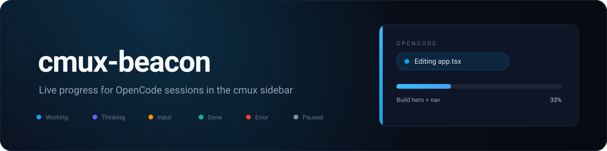

# cmux-beacon

[](LICENSE)
[](https://cmux.com)
[](https://opencode.ai/docs/plugins/)



cmux-beacon is a small [OpenCode](https://opencode.ai) plugin that mirrors a running session into the [cmux](https://cmux.com) workspace sidebar. The status pill, progress bar, step log and workspace color follow the agent automatically — no `cmux set-progress`, `set-status` or `log` calls, and no cooperation from the agent required.

## What it does

- **Progress bar** — exact `done/total` from the OpenCode todo list, plus an automatic activity bar before any plan exists.
- **Status pill** — live tool activity: `Running: npm run build`, `Editing app.tsx`, `Reading schema.ts`, `Waiting for input`, `Done`, `Error`.
- **Workspace color** — the sidebar stripe and title tint follow the current state.
- **Step log** — one entry per todo transition.
- **Subagents ignored** — child sessions never clobber the main tab.
- **Best-effort and silent** — a no-op outside cmux, and failures never touch the agent loop.

## State reference

| State | Pill | Bar | Color |
| --- | --- | --- | --- |
| Working | live tool or current step | `done/total` or activity | sky `#0ea5e9` |
| Thinking | `Thinking…` | activity | indigo `#6366f1` |
| Needs input | `Waiting for input` / `Waiting for your answer` | frozen | amber `#ff9500` |
| Done | `Done` | `100%` | teal `#12b3a6` |
| Error | `Error` | frozen | red `#ff3b30` |
| Paused | `Paused` | frozen | gray `#8e8e93` |

## Install

### One line

```sh
mkdir -p ~/.config/opencode/plugins
curl -fsSL https://raw.githubusercontent.com/abdallahaladl/cmux-beacon/main/src/cmux-beacon.js \
  -o ~/.config/opencode/plugins/cmux-beacon.js
```

Restart OpenCode. Files in `~/.config/opencode/plugins/` are loaded automatically.

### From source

```sh
git clone https://github.com/abdallahaladl/cmux-beacon.git
cp cmux-beacon/src/cmux-beacon.js ~/.config/opencode/plugins/
```

For a single project, place the file in `.opencode/plugins/` instead.

## Optional: keep the sidebar precise

cmux-beacon reads the OpenCode todo list, so the bar is most accurate when the agent keeps it updated. The companion instructions file asks the agent to do that:

```sh
curl -fsSL https://raw.githubusercontent.com/abdallahaladl/cmux-beacon/main/docs/agent-instructions.md \
  -o ~/.config/opencode/cmux-beacon.md
```

Reference it in `~/.config/opencode/opencode.json`:

```json
{
  "instructions": ["~/.config/opencode/cmux-beacon.md"]
}
```

## Configuration

| Variable | Default | Description |
| --- | --- | --- |
| `CMUX_BEACON_BIN` | `cmux` | Path to the cmux executable |
| `CMUX_BEACON_DISABLE` | — | Set to `1` to disable the plugin |
| `CMUX_BEACON_WORKSPACE_COLOR` | `1` | Set to `0` to leave the stripe and title alone |
| `CMUX_BEACON_STATUS_KEY` | `task` | Sidebar status key |
| `CMUX_BEACON_DONE_LINGER_MS` | `12000` | How long `Done` stays before clearing (`0` keeps it) |
| `CMUX_BEACON_MAX_LABEL` | `64` | Maximum pill and progress label length |

## How it works

OpenCode plugins subscribe to the event bus and tool hooks. cmux-beacon uses:

- `event` — `session.*`, `todo.updated`, `message.part.updated`, `permission.*`, `question.*`
- `tool.execute.before` / `tool.execute.after` — live tool labels

Each update becomes a detached `cmux` command (`set-status`, `set-progress`, `log`, `workspace-action`). Commands are deduplicated and skipped when nothing changed.

## Requirements

- [cmux](https://cmux.com) (tested with 0.64)
- [OpenCode](https://opencode.ai) 1.x

## Testing

```sh
node test/harness.mjs     # deterministic checks against a fake cmux
node test/live-test.mjs   # end-to-end against the real cmux socket (run inside cmux)
```

## License

[MIT](LICENSE) © Abdallah Aladl
